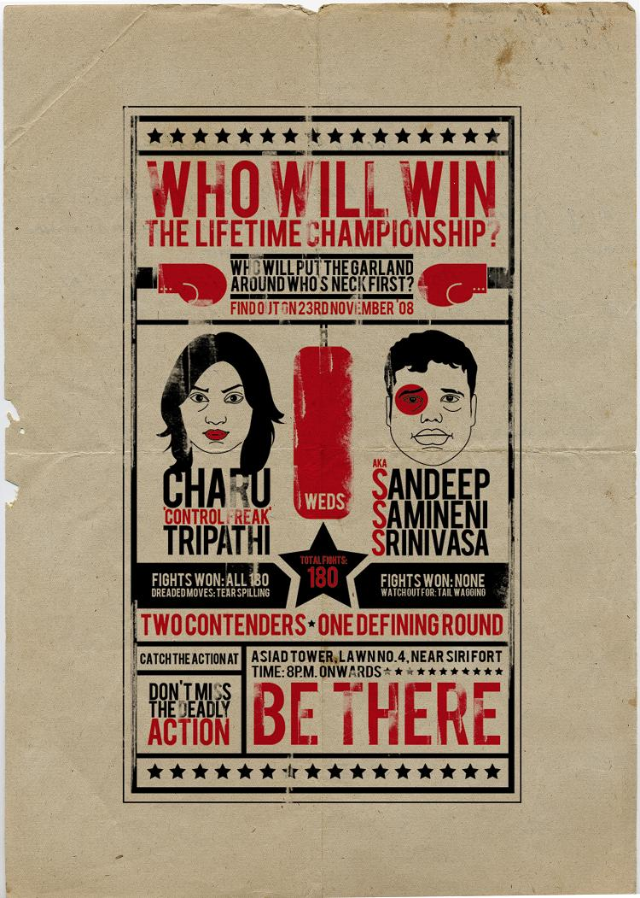

\[caption id="attachment\_179" align="alignleft" width="214" caption="Charu and My invitation"\]\[/caption\]

And that's what I found out these past three years, ever since that fateful day at the kickboxing gym. Was it very Christian of me, to adhere so strictly to the Book of Genesis? It sure did hurt ...

A wise man (or a seriously drunk one) once told me, "_parents know a lot.. but they dont know everything_". In this case, they sure did'nt - for not only do we not eat the same food, we dont speak the same native language. But, [Bollywood](http://en.wikipedia.org/wiki/Bollywood) and [Rajnikanth](http://en.wikipedia.org/wiki/Rajnikanth) unites all I'd say.

Please wish me luck in doing the dishes, taking the garbage out and not getting wasted on weekends. It is sure going to be hard.

Oh and the credit for the card goes to Charu, who used her enviable skills as a Copywriter to get it done and printed.
