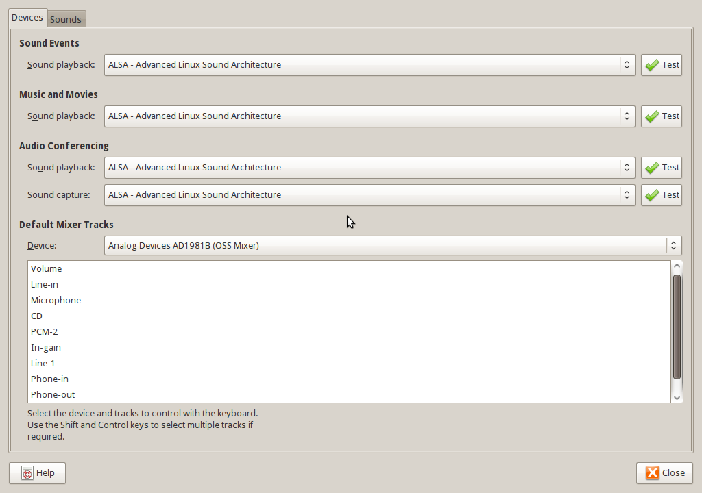
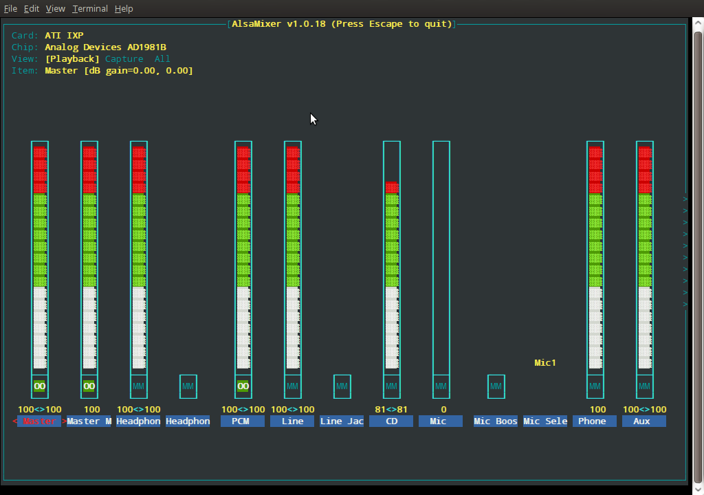
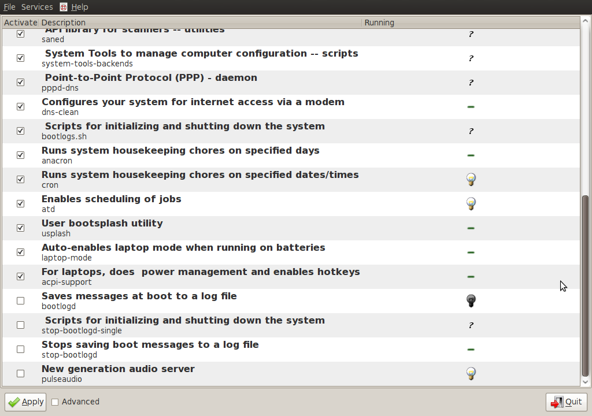

This was tough.. so here's a quick list:

- Your sound preferences should look like this:

\[caption id="attachment\_243" align="alignright" width="150" caption="R51e sound preferences"\]\[/caption\]

- Your alsamixer should look like this

\[caption id="attachment\_244" align="alignleft" width="150" caption="R51e alsa preferences"\]\[/caption\]  
  
  
  
  
  
  
  

- Install the following

> sudo apt-get install asoundconf-gtk gstreamer0.10-alsa libasound2-plugins libesd-alsa0

> sudo apt-get install gnome-alsamixer

> sudo apt-get install bum

- Your boot-up-manager should look like this (notice the unchecked PulseAudio) die.. pulse.. die!!

\[caption id="attachment\_245" align="alignright" width="150" caption="R51e boot up manager preferences"\]\[/caption\]

Reboot and enjoy
