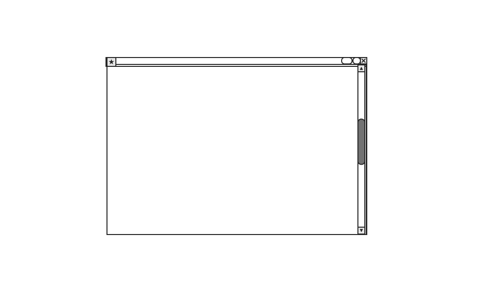
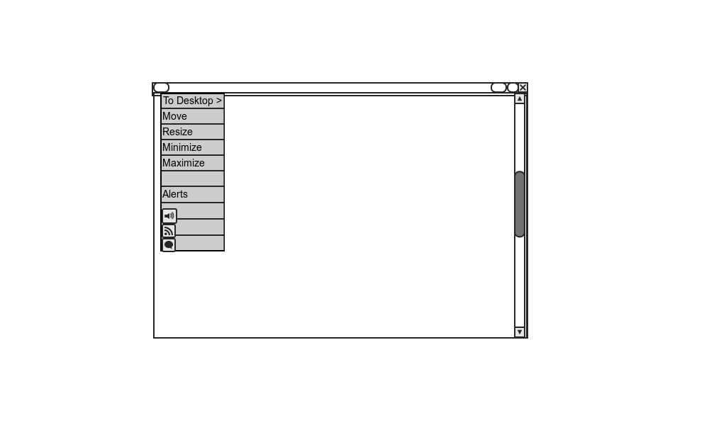

[Here](http://www.markshuttleworth.com/archives/333) is Mark Shuttleworth's original wireframes for Ubuntu windicators.

It is an interesting concept - now you can see why the window controls had to be moved to the left. However, there are some things you need to take note of:

1. Will this mean that themes which have right side window controls are incompatible or will it mean that all four buttons (close, max, min and window controls) have to be on one side ?
2. This will introduce a lot of complexity for window drawing (since as Shuttleworth himself says, "client side window decorations" are complex to implement)

I have an alternative concept - one that does not mess with the brains of ordinary Linux users and still satisfies the basic premise of _windicators._

