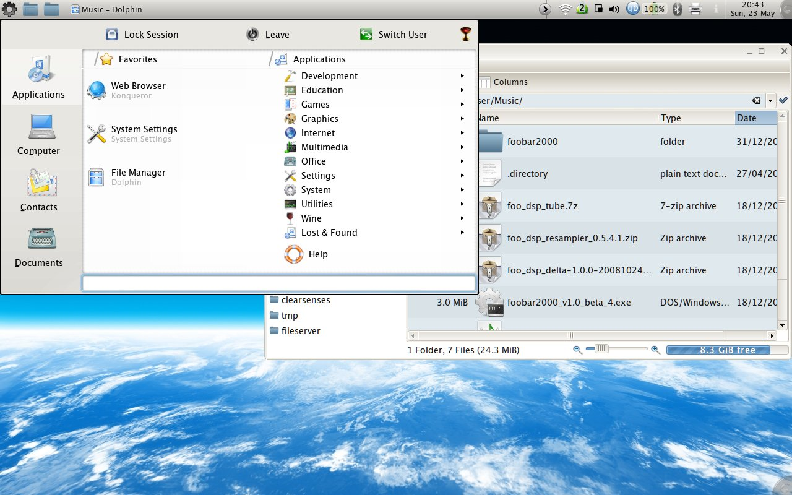

Because it still makes sense .... as a user, I think KDE has a plethora of software that makes it work well. You just need to get rid of the shit that you dont need.

My Kubuntu 10.04 takes up 300mb on startup - and I know that it takes a lot more the majority out there. How do I do it:

- Get rid of Nepomuk and Strigi - you cant uninstall it, but [disable](http://www.freetechie.com/blog/disable-nepomuk-desktop-search-on-kde-4-4-2-kubuntu-lucid-10-04/) it.
- [Disable](http://techbase.kde.org/Projects/PIM/Akonadi#How_do_I_disable_automatic_migration_from_KDE.27s_traditional_framework.3F) akonadi (you would think this would be easy to google!)

> kwriteconfig –file kres-migratorrc –group Migration –key Enabled –type bool false
> 
> - You also now need to get rid of all your dependent software - Kmail, Akregator, Kontact, Korganizer, Kalarm, Ktorrent (I have an alternative), Quassel, etc.

- Install qBittorrent (a thoroughly superior and lighter client IMHO), for heaven's sake use Thunderbird (quit the "_die GTK!_" shouting), Xchat and Chromium, Choqok (for Twitter).
- Preserve your sanity and [configure](http://userbase.kde.org/Plasma#Activities_and_Virtual_Desktops) to have a different Activity for each Desktop (different wallpapers for each virtual desktop !!)
- Most **importantly**, quit the Konsole bullcrap and use the best, fastest, lightest and most configurable (tab supporting!) term ever made - mrxvt .Use my [mrxvtrc](http://github.com/sandys/scripts/blob/master/.mrxvtrc) if so inclined - which sort of mimics the konsole keymappings (ctrl-shift-left and right work!)
- Atleast use Lucida Grande or Droid fonts on you desktop (enable anti-aliasing and make sure you disable the "Exclude range"). Just unzip the TTF or OTF to your _~/.fonts_ directory and run _fc-cache -f -v_

Optional and cutting edge:

- Use [Lancelot](http://lancelot.fomentgroup.org/main), the next gen KDE menu and runner - Ivan is highly responsive to filed bugs and it works quite well.
- Use _[plasma-widget-networkmanagent](http://osdir.com/ml/kubuntu-devel/2010-03/msg00013.html)_ instead of the default Knetworkmanager
- Drop the default Oxygen/Air theme - it looks like crap and consumes too much CPU. I use _QtCurve_ for widget style, _Shadowport_ for Workspace theme and _Kanzi_ for icons.

\[caption id="attachment\_377" align="aligncenter" width="300" caption="My Desktop"\]\[/caption\]

Why does KDE still make sense ?

[Kdiff3](http://kdiff3.sourceforge.net/), [Kompare](http://en.wikipedia.org/wiki/Kompare) and [Kdevelop](http://www.kdevelop.org/) simply have no parallel if you are a programmer. I wanted to read CHM documentation on Linux - [Kchmviewer](http://www.kchmviewer.net/) is the best. qBittorrent kicks butt - it is much better than Transmission or Ktorrent (qBittorrent was the first client to support the magnet protocol, if I'm not wrong). Kate as an editor is pretty decent (if you enable it's snippets Plugin .. though I personally use gvim)

But I want to conclude with a rant - the KDE community is dogmatic enough that requests for lean, mean usable KDE is frowned upon: it is the rabid fanaticism of OSX without the good looks. I tried building kdelibs by disabling Strigi and I was able to - I dont understand why someone who has a lot more experience than me, cant (or wont create) a version without all these dependencies... in effect a stripped down KDE.

And the theme - transparency and lots of wasted space dont look good. For instance look at the [Avant](http://kde-look.org/content/show.php/Avant%20%5BPretty%20Please%20REQUEST!%5D?content=101283) theme idea (created by [Neil Patel](http://njpatel.blogspot.com/)) .. efficient usage of space and minimalism. Somebody please create this!

Let me try - maybe I'll get half the way at creating a stripped down KDE.

, [Neil Patel](http://njpatel.blogspot.com/)
