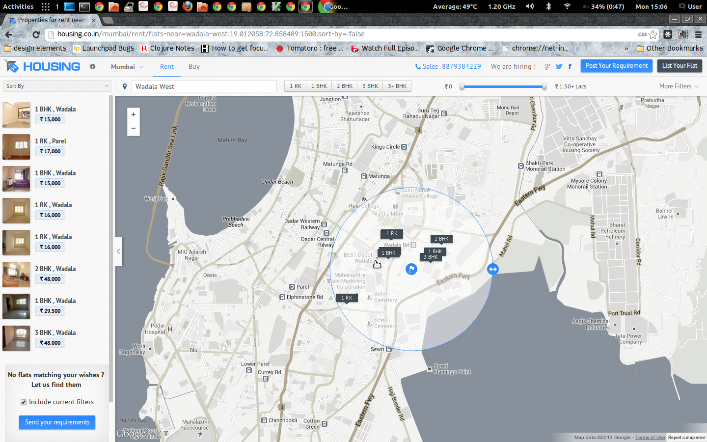
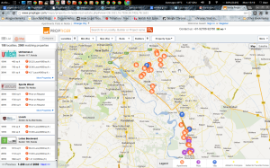
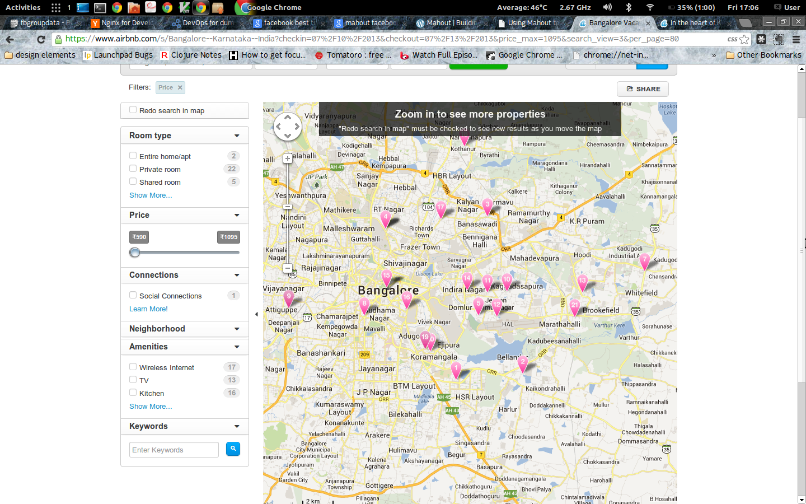

So you have a Google map widget and you have plotted a few locations on it - say the new properties for sale in your city. Awesome ! How long did it take you ?  one week.

Now tell me what happens when you click on any property ? Answer seems obvious right - hey you show some stuff from the location you clicked.

_**Wrong answer.**_

The best way to understand this is to ask the following question - what exactly did you click on ? That answer is very contextual to India. What happens in India is huge housing projects with almost a 1000 residential units - but with a large number of different types (for e.g. 1 bedroom - 2 toilets or 1 bedroom - 1 toilet - 1 servant quarters... etc.). Therefore, this information can not be aggregated.

**The US way.**

Remember when I said this problem is not present in the US due to homogeneity in housing units plus the spatial distribution of properties ? Well, there is one context in which you can see the same problem - mobile. The density of information in the US at this screen size encounters the same interaction design problems as desktop maps in India.

Take for example Trulia's Android app

What you see here is an interaction that happens when you touch a particular point on the mobile screen.  The circle (and the list below that corresponds to the radius of the circle) is part of that interaction. Let's analyze the reasons.

Several mapping based sites/apps load all the data at once. This is a by product of having a limited data set to work upon. If this is the case, then you can zoom in/out, drag/pan as you like to focus on a particular point. Several examples of these are Magicbricks, Housing.co.in , etc.

However, if you have a large data set (as we had in Proptiger), then you need to plot the data based on the viewport that you have at that moment. (This will need you to have an API that supports viewport based queries). Now what happens at this point is that any interaction on the map - zoom, pan, etc. - refetches results from your database. Which means that when you zoom down, there is an entirely new set of results (with appropriate sorting) resulting in your original point-of-interest vanishing. This is an extremely important aspect of map based UXes with significant data.

Do note that there is another data interaction possible - something that vaniila google maps does very well. The map is secondary, the list on the left is primary - this means that once people are looking a particular paged set of results on the left, the map does not re-query on any pan/zoom. Now this works well for a _known-item browse_ _behavior_ (in UX design terms), but not for an exploratory map-centric behavior. In the real-estate paradigm, one of the big problems that can occur because of this is seeming empty spaces on the map even when you have zoomed to it because the list is still static. The best way to illustrate this is to look at how Airbnb represents its map results - the fact that you cannot zoom without reloading vs not reloading and having less results is obvious in its "_**Zoom in to see more properties - Redo search in map must be checked to see new results as you move the map**_" aspect. I'm not really sure how usable that is in India.

_**Fun**_ _**fact**_: It just so happens that implementing the javascript hooks to work with the panning/zooming and refreshing of data is a very hairy task. This all stems primarily from the [quirky interaction between _fitBounds_ and](http://stackoverflow.com/questions/13777318/set-google-map-zoom-level-after-using-fitbound) _[setZoom](http://stackoverflow.com/questions/13777318/set-google-map-zoom-level-after-using-fitbound)._ 

 So what's the solution - put simply it is this: **somehow prevent people from zooming to isolate a data point.** This is a UX problem - you need to somehow give an interaction to people that prevents them from panning and zooming. In my understanding there are two ways to achieve that:

- _Radius of interest_ - draw a small circle **around** the point of interest (regardless of touch and click) and give a separate popup which has a small limited set of results around there. Using this popup, you can zero-in to the exact point of interest. This is what Trulia does in its mobile app and Housing.co.in is starting to do in its desktop app
- _Spidering_ - It is the same theory as OSX fan of icons (technically called [Stacks](http://support.apple.com/kb/ht3739)). This is something we have attempted at Proptiger. Clicking on a close group of icons spreads it out as a fan allowing you to pick and choose.

<!---> [Map icons - grouped (before)](images/screenshot-from-2013-06-17-151102.png) --->
This is just the first step for building UXes with large amounts of data on a map. Wonder what's the next step ;)
